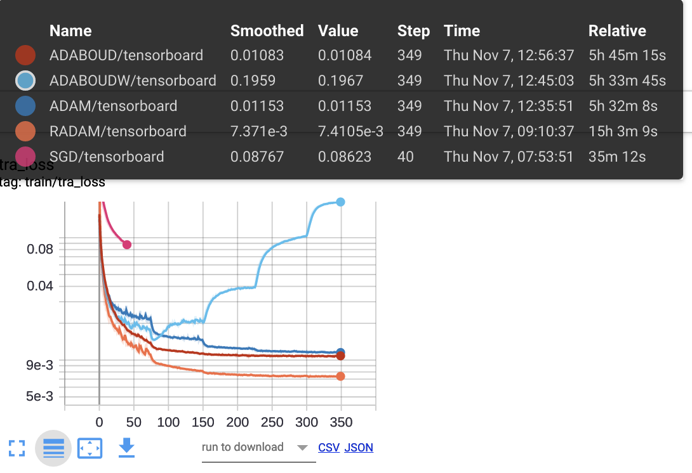
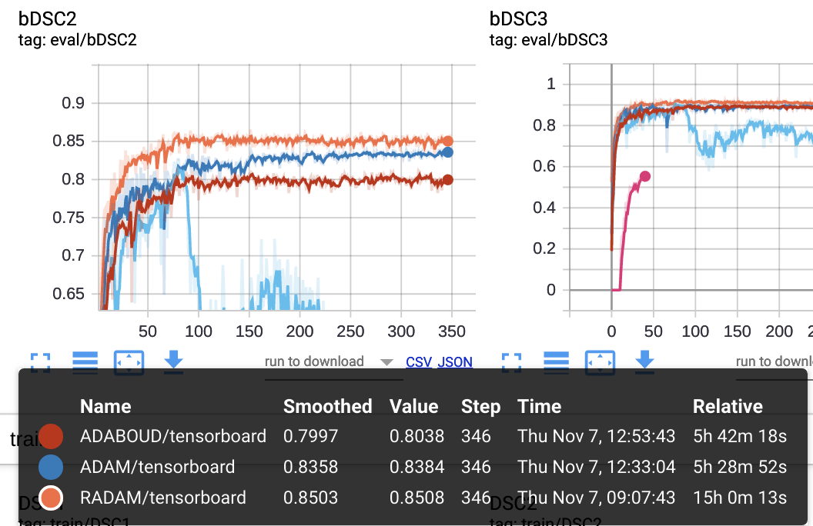

# Prior-aware Netrual Network (PaNN) and its optimization
---

#### Verification of Optimization proposed in section `3.2` and `3.3` of the paper [`Prior-aware Neural Network for Partially-Supervised Multi-Organ Segmentation`](https://arxiv.org/abs/1904.06346)

  

where `q` is a predefined distribution which is fixed and  is the marginal distribution of all pixel predictions

There might be some mistakes of the original paper, `Equ. 2` has redundent components, meaning an increased learning rate for optimization.

The paper claims that the optimization of   = `log(mean(all_pixel_predictions))` may be problematic thus biased. This kined of optimization is in fact widely used in `Mutual information maximization` or `conditional entropy minimization`.
See my [paper](https://arxiv.org/abs/1910.01665) for a reference. 

The Interesting solution in the paper would be to use the `primal-dual gradient` method. This folder reproduce this kind of optimization for semi-supervised learning with ACDC dataset to understand the advantage of the proposed method.

---

---
### We tested different optimizers in this segmentation task, including `Adam`, `RAdam`, and `AdaBound`.

training loss:

validation dice:
